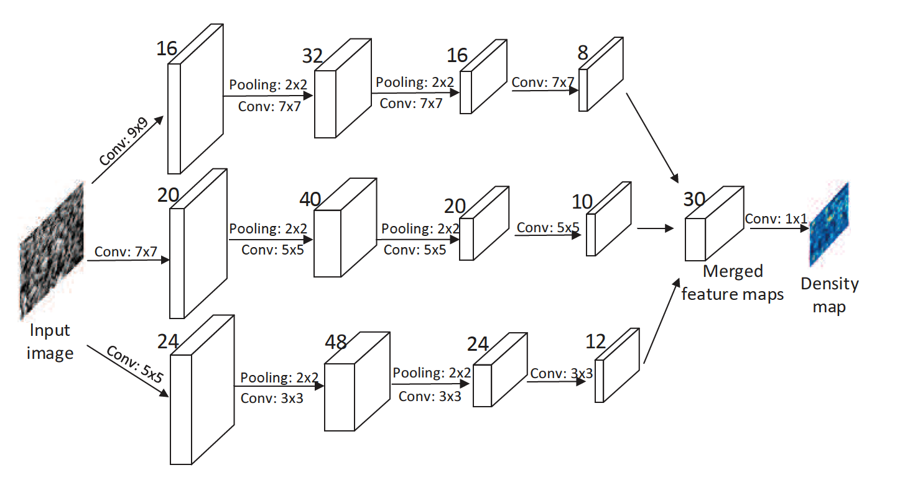

# Crowd Counting using Convolutional Neural Networks

The need for an accurate crowd counting is as old as the mankind itself. Being it for the use of counting the sizes of animal herds, enemy armies or assessing the audience size for safety reasons, people could have always taken a significant advantage of knowing the precise crowd counts. With the introduction of computer vision and crowd counting algorithms using convolutional neural networks these counting predictions became more accurate than ever before. These aspects became one of the major inspirations for our team to take on this topic and deep dive into the crowd counting state-of-the-art techniques for our Integrify graduation project.

Our team consists of [Nhu Nguyen](https://github.com/joycenhunguyen), [Thuong Nguyen](https://github.com/Thuong89) and [Radim Musalek](https://github.com/RadimMusalek).

The project is devided into the following parts:
1. Theoretical introduction of two state-of-the-art models:
    - multi-column convolutional neural network model (MCNN)
    - dilated convolutional neural networks model (dilated CNNs)
2. ShanghaiTech datasets introduction (the datasets used for the models training)
3. Model introduction
4. Implementation and deployment
5. Conclusion

## Crowd counting - purpose and use

As mentioned in the project's introduction the crowd counting techniques has been around for the bigger part of mankind's history. However, in the modern world the crowd counting algorithms' use can be extended from the purposes named above beyond its human-centered application into other areas where crowds are formed such as animal herds, on-land and on-sea traffic, concentrations of cancer cells, bacteria and other microbiology, medical, etc. applications.

Although in our work we apply the model to a static single-image crowd counting problem it can be used also for crowd counting from videos. Therefore, bringing an important feature for real-time evaluation problems where the size of a crowd needs to be assessed continuously. 

## Original paper introducing the ShanghaiTech datasets and using MCNN model

Our project is based on the [paper published by Yingying Zhang, Desen Zhou, Siqin Chen, Shenghua Gao and Yi Ma of the Shanghaitech University](https://github.com/joycenhunguyen/Crowd-counting/blob/main/linked_docs/Zhang_Single-Image_Crowd_Counting_CVPR_2016_paper.pdf) in 2016 which introduced the ShanghaiTech datasets A and B, and the state-of-the-art crowd counting model using the MCNN.

The proposed MCNN model contains three columns of CNNs whose filters have different sizes. Input of the MCNN is the image, and its output is a crowd density map whose integral gives the overall crowd count. For each column filters of different sizes are used to model the density maps corresponding to heads of different scales. For instance, filters with larger receptive fields are more useful for modeling the density maps corresponding to larger heads. The same network structures are used for all columns with the exception of the sizes and numbers of filters. Max pooling is applied for each 2×2 region and Rectified linear unit (ReLU) is adopted as the activation function.

To reduce the computational complexity, the authors used fewer filters for CNNs with larger filters. They stacked the output feature maps of all CNNs and mapped them to a density map. To map the features maps to the density map, they adopted filters whose sizes are 1×1. Then Euclidean distance is used to measure the difference between the estimated density map and ground truth.

For better understanding the visualisation of the model's architecture is below:

To evaluate the model's performance on this (and other) dataset in their paper the authors chose the Mean Absolute Error (MAE) and Mean Squared Error (MSE). Their results of both the Part A and Part B of the Shanghaitech dataset can be found in the below table. We selected these performance evaluators also for the other models to be able to compare their performances.

| Dataset |  MAE  |  MSE  |
| :-----: | :---: | :---: |
|   SHA   | 110.2 | 173.2 |
|   SHB   |  26.4 |  41.3 |

## Improved crowd counting model using dilated CNNs

The paper [CSRNet: Dilated Convolutional Neural Networks for Understanding the Highly Congested Scenes by Yuhong Li, Xiaofan Zhang, and Deming Chen of the Beijing University of Posts and Telecommunications and University of Illinois at Urbana-Champaign](https://github.com/joycenhunguyen/Crowd-counting/blob/main/linked_docs/CSRNet_Dilated_Convolutional_Neural_Networks_for_U.pdf) was published in March 2018 and introduced the dilated CNNs model for solving crowd counting tasks.

The CSRNet model is trying to fix some of the disadvantages of the earlier models such as the large training time and less effective branch structures, e.g. such as in the above explained original model using MCNN.

The first 10 convolutional layers of the model are fine-tuned from a well-trained VGG-16. For the following 6 layers at the back-end of the model, the initial values come from a Gaussian initialization with 0.01 standard deviation. Stochastic gradient descent (SGD) is applied with fixed learning rate at 1e-6 during training. Also, the authors chose the Euclidean distance to measure the difference between the ground truth and the estimated density map we generated which is similar to other works, e.g. the original Shaghaitech paper introduced earlier.

The following data augmentation process was used for the model training purposes - the authors cropped 9 patches from each image at different locations with 1/4 size of the original image. The first four patches contain four quarters of the image without overlapping while the other five patches are randomly cropped from the input image. After that, they mirrored the patches so that they doubled the training set.

The authors achived the best results with the version B of their model architeture, i.e. one using the dilation rate = 2 for all the convolution layers in the back-end part, which was used also for their model's performance evalution on all datasets cover in their paper.

For better understanding and comparison to the MCNN model, the visualisation of the model's architecture is below:

It delivered a significant improvement in both the MAE and MSE results compare to the previously seen numbers that used the MCNN model.

| Dataset |  MAE  |  MSE  |
| :-----: | :---: | :---: |
|   SHA   |  68.2 | 115.0 |
|   SHB   |  10.6 |  16.0 |

## Training dataset - Shanghaitech

The dataset called Shanghaitech was introduced in the MCNN paper described earlier. It includes nearly 1,200 large-scale crowd images with around 330,000 labeled heads. The dataset consists of two parts: Part A and Part B. Images in Part A are randomly crawled from the Internet, most of them have a large number of people. Part B images are taken from busy streets of metropolitan areas in Shanghai by the authors who also manually annotated images in both parts. No two images in this dataset are taken from the same viewpoint.

The crowd density varies significantly between the two subsets, making accurate estimation of the crowd more challenging than most existing datasets. Both Part A and Part B are divided into training and testing: 300 images of Part A are used for training and the remaining 182 images for testing;, and 400 images of Part B are for training and 316 for testing.

## Model

The model which we use in our deployment is the [Zheng Peng's Keras implemention of the dilated CNNs methodology](https://github.com/ZhengPeng7/CSRNet-Keras) proposed by the CSRNet model paper described earlier in our work, its version B to be more specific. Zheng Peng was able to further improve the dilated CNN model's performance on both datasets as can be seen from the MAE/MSE overview below. This is the best performing model on the ShanghaiTech datasets we were able to find during our research for this project, however, since it had been created in July 2019 (i.e. relatively "old" considering the rapid progress in the world of machine learning), we acknowledge it is likely that there might be even more accurate and/or faster learning model which we just didn't come across.

Zheng Peng's CSRNet model uses the same architecture as the original CSRNet model, however, the SGD's learning rate applied during the training is 1e-5 compare to the original's 1e-6 and the loss function was set to MSE instead of Euclidean distance.

Again the MAE and MSE results indicating the model's performance improvement are displayed below:

| Dataset |  MAE  |  MSE   |
| :-----: | :---: | :---:  |
|   SHA   | 67.98 | 103.24 |
|   SHB   |  8.31 |  14.36 |
